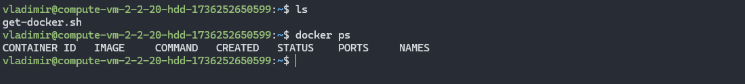
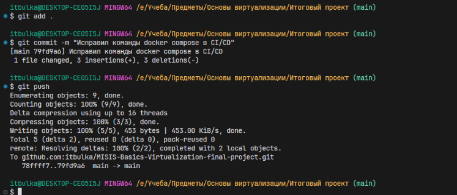
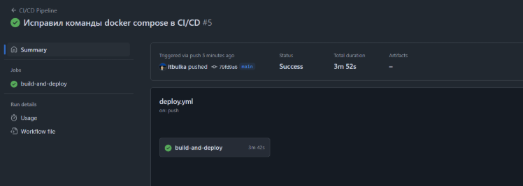
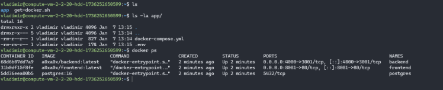
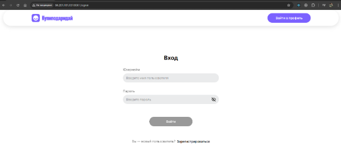
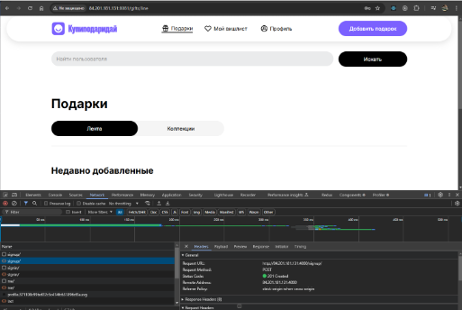

# Докеризация приложения
За основу взял учебный проект КупиПодариДай. API для сервиса купиПодариДай разрабатывал сам и подготовленный frontend  

Исходные репозитории:  
`Backend`: https://github.com/itbulka/kupipodariday-backend  
`Frontend`: https://github.com/yandex-praktikum/kupipodariday-frontend

### Ход работы:
---
### Создание Dockerfile для наших сервисов Frontend и backend
**Dockerfile для Backend представлен в `./backend/Dockerfile`**  
В этом Dockerfile используется многоступенчатая сборка, которая позволяет уменьшить размер итогового образа и исключить лишние файлы, не нужные для работы приложения.

В качестве основы мы берем образ `node16-alpine`, после чего копируем файлы `package.json`, необходимые для установки зависимостей, и устанавливаем их с помощью команды `npm run install`. Когда все зависимости установлены, мы собираем проект с помощью команды `npm run build`, завершая первый этап сборки.

На втором этапе мы снова используем образ `node16-alpine` в качестве основы, копируем уже собранный проект в рабочую директорию, устанавливаем необходимые инструменты для запуска сервиса, копируем дополнительные конфигурационные файлы, устанавливаем только prod зависимости и запускаем наш backend сервис с помощью инструмента pm2.

**Dockerfile для Frontend представлен в `./frontend/Dockerfile`**  
В этом файле используется многоэтапная сборка, чтобы уменьшить размер образа и исключить лишние файлы, которые не нужны для конечного продукта. За основу берется образ `node16-alpine`, в который копируются необходимые файлы для установки зависимостей. Затем с помощью команды `npm run build` собирается проект.

На втором этапе за основу берется образ nginx. Собранный проект копируется в стандартную директорию для раздачи статических файлов Nginx — /usr/share/nginx/html. Также необходимо скопировать уже подготовленный конфигурационный файл nginx в директорию /etc/nginx/conf.d внутри контейнера. Этот файл будет отвечать за раздачу статических файлов нашего проекта.  
Посмотреть конфигурационный файл nginx можно по следующему пути `./frontend/nginx/conf.d/default.conf`

### Описание docker-compose файла для запуска одновременно нескольких контейнеров
Он находится в корне проекта `docker-compose.yml`  

**Сервис postgres**  
Этот сервис отвечает за хранение данных приложения и использует образ PostgreSQL 16-й версии. При запуске контейнер будет именоваться postgres. Для его работы требуются переменные окружения, которые указаны в файле .env, пример этого файла можно посмотреть в .env.example

Данные базы данных монтируются в том postgres_data, что обеспечивает их сохранность между перезапусками контейнера. В случае сбоя контейнер будет автоматически перезапущен, за исключением случаев, когда он был явно остановлен (с использованием опции restart: unless-stopped). Контейнер будет подключен к сети backend.

**Сервис backend**  
Этот компонент является серверной частью приложения и строится на основе Dockerfile в каталоге backend или берется с Docker Hub, если такой имеется. При запуске контейнер получает имя backend. Для подключения к базе данных backend также использует переменные окружения, поэтому для него применяется тот же файл .env, что и для сервиса postgres.

По умолчанию backend запускается на 3001 порту, однако мы выполняем проброс портов. Внутри контейнера он будет работать на 3001 порту, а снаружи, чтобы к нему можно было подключиться, будет доступен порт 4000. Контейнер автоматически перезапускается в случае сбоя, за исключением случаев, когда он был явно остановлен (также с использованием опции restart: unless-stopped).

Контейнер зависит от сервиса postgres, поэтому должен запускаться только после того, как будет готов сервис postgres. Для обеспечения связи между backend и базой данных контейнер подключается к сети backend.

**Сервис Frontend**    
Это клиентская часть нашего приложения. Контейнер для неё будет создаваться на основе Dockerfile, расположенного в каталоге frontend, или браться с Docker Hub, если такой имеется. При запуске контейнер получит имя frontend. В случае сбоя контейнер будет автоматически перезапускаться, за исключением ситуаций, когда он был явно остановлен (с использованием опции restart: unless-stopped).

Внешний порт 8081 на хосте будет пробрасываться на внутренний порт 80 в контейнере. Доступ к сети frontend можно получить, подключившись к сети frontend.

**Дополнительные настройки**   
В самом конце файла определяются уже сами сети и тома, которые используются.

### Настройка CI/CD для с использованием GitHub Actions  
Файл настройки CI/CD распаложен в `.github/workflows/deploy.yml ` 

Мы уже заранее подготовили и настроили сервер в Яндекс Облаке, установив все необходимые инструменты и программы. После чего можно приступить к созданию конфигурационного файла для нашей CI/CD-системы.

**Логика работы будет следующей:**  
При каждом обновлении в основной ветке (main) система будет собирать образы наших сервисов и публиковать их в Docker Hub. Затем она загрузит на удаленный сервер файл docker-compose и создаст файл .env с необходимыми переменными. Значения этих переменных будут храниться в GitHub Secrets для обеспечения гибкости и безопасности.

После выполнения подготовительных шагов на удаленном сервере будут запущены команды для скачивания образов, ранее опубликованных в Docker Hub, и запуска контейнеров с нашими сервисами с помощью команды `docker-compose up`.

### Демонстрация работы:
- Подключимся к нашему серверу и посмотрим наполнение домашней директории и список запущенных контейнеров.  
  
Как мы видим директория пуста и запущенных контейнеров нет.

- Теперь запушим какие-то изменения в ветку main и посмотрим на результат работы CI/CD.  
  
  
Как мы видим, всё прошло без каких-либо проблем.

- Теперь мы зайдем на сервер и проверим состояние домашней директории и запущенных контейнеров.
  
Мы видим, что домашняя директория больше не пуста, и в ней запущены контейнеры с нашими сервисами.

- Теперь если перейти по адресу `http://84.201.181.131:8081/` у нас открывается наш frontend, который спокойно взаимодействует с нашим backend. Все запросы выполняются корректно.  
  

