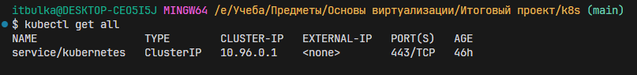
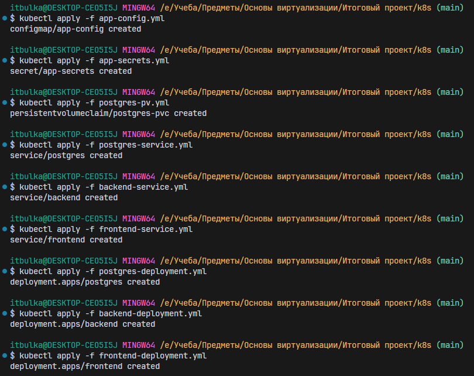
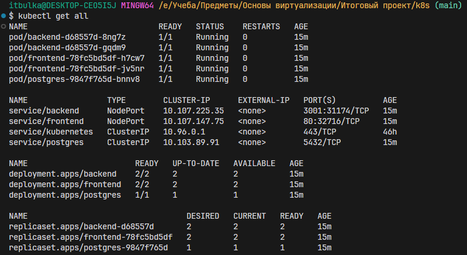
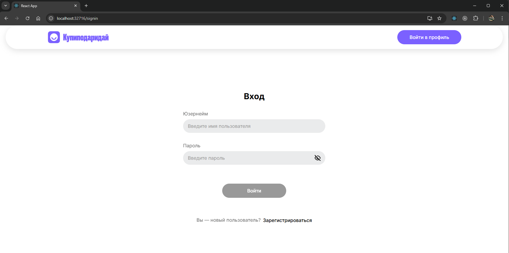
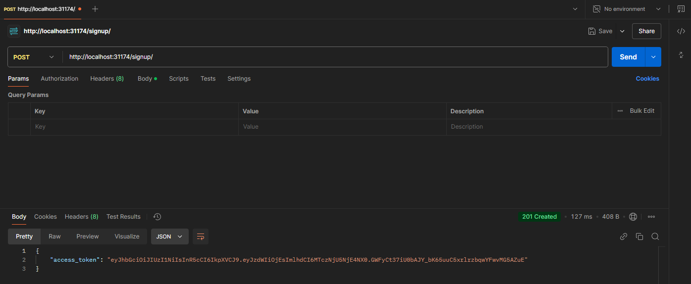

# Докеризация приложения
За основу взял учебный проект КупиПодариДай. API для сервиса купиПодариДай разрабатывал сам и подготовленный frontend  

Исходные репозитории:  
`Backend`: https://github.com/itbulka/kupipodariday-backend  
`Frontend`: https://github.com/yandex-praktikum/kupipodariday-frontend

### Ход работы:
---
### Создание Dockerfile для наших сервисов Frontend и backend
**Dockerfile для Backend представлен в `./backend/Dockerfile`**  
В этом Dockerfile используется многоступенчатая сборка, которая позволяет уменьшить размер итогового образа и исключить лишние файлы, не нужные для работы приложения.

В качестве основы мы берем образ `node16-alpine`, после чего копируем файлы `package.json`, необходимые для установки зависимостей, и устанавливаем их с помощью команды `npm run install`. Когда все зависимости установлены, мы собираем проект с помощью команды `npm run build`, завершая первый этап сборки.

На втором этапе мы снова используем образ `node16-alpine` в качестве основы, копируем уже собранный проект в рабочую директорию, устанавливаем необходимые инструменты для запуска сервиса, копируем дополнительные конфигурационные файлы, устанавливаем только prod зависимости и запускаем наш backend сервис с помощью инструмента pm2.

**Dockerfile для Frontend представлен в `./frontend/Dockerfile`**  
В этом файле используется многоэтапная сборка, чтобы уменьшить размер образа и исключить лишние файлы, которые не нужны для конечного продукта. За основу берется образ `node16-alpine`, в который копируются необходимые файлы для установки зависимостей. Затем с помощью команды `npm run build` собирается проект.

На втором этапе за основу берется образ nginx. Собранный проект копируется в стандартную директорию для раздачи статических файлов Nginx — /usr/share/nginx/html. Также необходимо скопировать уже подготовленный конфигурационный файл nginx в директорию /etc/nginx/conf.d внутри контейнера. Этот файл будет отвечать за раздачу статических файлов нашего проекта.  
Посмотреть конфигурационный файл nginx можно по следующему пути `./frontend/nginx/conf.d/default.conf`

### Описание docker-compose файла для запуска одновременно нескольких контейнеров
Он находится в корне проекта `docker-compose.yml`  

**Сервис postgres**  
Этот сервис отвечает за хранение данных приложения и использует образ PostgreSQL 16-й версии. При запуске контейнер будет именоваться postgres. Для его работы требуются переменные окружения, которые указаны в файле .env, пример этого файла можно посмотреть в .env.example

Данные базы данных монтируются в том postgres_data, что обеспечивает их сохранность между перезапусками контейнера. В случае сбоя контейнер будет автоматически перезапущен, за исключением случаев, когда он был явно остановлен (с использованием опции restart: unless-stopped). Контейнер будет подключен к сети backend.

**Сервис backend**  
Этот компонент является серверной частью приложения и строится на основе Dockerfile в каталоге backend или берется с Docker Hub, если такой имеется. При запуске контейнер получает имя backend. Для подключения к базе данных backend также использует переменные окружения, поэтому для него применяется тот же файл .env, что и для сервиса postgres.

По умолчанию backend запускается на 3001 порту, однако мы выполняем проброс портов. Внутри контейнера он будет работать на 3001 порту, а снаружи, чтобы к нему можно было подключиться, будет доступен порт 4000. Контейнер автоматически перезапускается в случае сбоя, за исключением случаев, когда он был явно остановлен (также с использованием опции restart: unless-stopped).

Контейнер зависит от сервиса postgres, поэтому должен запускаться только после того, как будет готов сервис postgres. Для обеспечения связи между backend и базой данных контейнер подключается к сети backend.

**Сервис Frontend**    
Это клиентская часть нашего приложения. Контейнер для неё будет создаваться на основе Dockerfile, расположенного в каталоге frontend, или браться с Docker Hub, если такой имеется. При запуске контейнер получит имя frontend. В случае сбоя контейнер будет автоматически перезапускаться, за исключением ситуаций, когда он был явно остановлен (с использованием опции restart: unless-stopped).

Внешний порт 8081 на хосте будет пробрасываться на внутренний порт 80 в контейнере. Доступ к сети frontend можно получить, подключившись к сети frontend.

**Дополнительные настройки**   
В самом конце файла определяются уже сами сети и тома, которые используются.

### Настройка CI/CD для с использованием GitHub Actions  
Файл настройки CI/CD распаложен в `.github/workflows/deploy.yml ` 

Мы уже заранее подготовили и настроили сервер в Яндекс Облаке, установив все необходимые инструменты и программы. После чего можно приступить к созданию конфигурационного файла для нашей CI/CD-системы.

**Логика работы будет следующей:**  
При каждом обновлении в основной ветке (main) система будет собирать образы наших сервисов и публиковать их в Docker Hub. Затем она загрузит на удаленный сервер файл docker-compose и создаст файл .env с необходимыми переменными. Значения этих переменных будут храниться в GitHub Secrets для обеспечения гибкости и безопасности.

После выполнения подготовительных шагов на удаленном сервере будут запущены команды для скачивания образов, ранее опубликованных в Docker Hub, и запуска контейнеров с нашими сервисами с помощью команды `docker-compose up`.

### Демонстрация работы:
- Подключимся к нашему серверу и посмотрим наполнение домашней директории и список запущенных контейнеров.  
  
Как мы видим директория пуста и запущенных контейнеров нет.

- Теперь запушим какие-то изменения в ветку main и посмотрим на результат работы CI/CD.  
  
  
Как мы видим, всё прошло без каких-либо проблем.

- Теперь мы зайдем на сервер и проверим состояние домашней директории и запущенных контейнеров.
  
Мы видим, что домашняя директория больше не пуста, и в ней запущены контейнеры с нашими сервисами.

- Теперь если перейти по адресу `http://84.201.181.131:8081/` у нас открывается наш frontend, который спокойно взаимодействует с нашим backend. Все запросы выполняются корректно.  
  

---
### Работа с k8s
Опишем все необходимые манифесты для работы нашего приложения. Нам понадобится написать конфиги для `postgres`, `backend` и `frontend`. 
- Для каждого приложения потребуется описать `Deployment` и `Service`.  
***Deployment*** — это объект Kubernetes, который управляет развертыванием и масштабированием приложения. Он описывает, как должны быть запущены и обновлены поды (контейнеры) в кластере. Основные задачи Deployment  
***Service*** — это объект Kubernetes, который определяет способ доступа к приложениям, работающим внутри подов. Он создает стабильный IP-адрес и DNS-имя для доступа к подам, а также обеспечивает балансировку нагрузки между подами.  
>Другими словами `Deployment` нужен, чтобы запустить приложения, а `Service` говорит как можно до них достучаться.  

- Для `postgres` еще понадобится такой ресурс как `PV` и `PVC`. Мы описали PVC, а PV k8s создат автоматически, хотя можно и самому написать конфиг для PV.  
***Persistent Volume (PV)*** — это объект в Kubernetes, который представляет собой физическое хранилище данных, доступное для использования в кластере. Он абстрагирует детали хранилища, позволяя приложениям безопасно и надежно сохранять данные, даже если поды, использующие это хранилище, перезапускаются или перемещаются на другие узлы.  
***PersistentVolumeClaim (PVC)*** — это объект в Kubernetes, который используется для запроса хранилища (persistent storage) с конкретными требованиями, такими как размер и тип доступа, от PersistentVolume (PV). PVC действует как "запрос" к хранилищу, который Kubernetes пытается удовлетворить, находя подходящий Persistent Volume. Это позволяет абстрагировать детали хранилища и использовать его в приложениях без необходимости прямого указания, где и как хранить данные.  

- В сервисах `postgres` и `backend` используются переменные окружения. Передавать файлик `.env` как в `docker-compose` в `k8s` нельзя, для этого используются такие типы ресурсов, как `ConfigMap` и `Secret`.  
***ConfigMap*** — это объект Kubernetes, который используется для хранения конфигурационных данных, которые могут быть использованы подами или контейнерами в кластере. ConfigMap хранит данные в виде пар "ключ-значение" и позволяет передавать параметры конфигурации для приложений, не требуя пересборки контейнеров.  
***Secrets*** — это объект Kubernetes, предназначенный для хранения конфиденциальных данных, таких как пароли, токены, ключи API и сертификаты. Secrets обеспечивают безопасное хранение данных, потому что они могут быть закодированы и защищены с помощью механизмов безопасности Kubernetes.  

### **Краткое описание манифестов**  
### Deployment ###  
Для всех `Deployment` будет почти одинаковый. Поэтому за пример возьмем `postgres-deployment`.  

`metadata.name:` Устанавливает имя деплоймента — в этом случае это postgres.

`spec.replicas:` Указывает количество реплик (подов), которые должны быть запущены. В данном примере это 1 реплика, то есть 1 под с PostgreSQL.

`selector.matchLabels: ` 
В этом блоке указано правило для выбора подов, к которым будет применяться деплоймент. Это ключевая часть для ассоциации деплоймента с подами.  
matchLabels говорит Kubernetes, что деплоймент будет управлять подами, которые имеют метку app: postgres. Это означает, что все поды с этой меткой будут частью деплоймента.

`template.metadata.labels:`
В шаблоне пода указываются метки, которые будут назначены каждому контейнеру внутри пода.  
Эти метки помогают Kubernetes и другим сервисам (например, Services) находить поды, чтобы связать их с нужными ресурсами.  
Здесь метка app: postgres соответствует метке, использованной в селекторе, что позволяет деплойменту управлять подами, имеющими эту метку.

`containers:  `
Это список контейнеров, которые будут развернуты в поде. В данном случае контейнер с образом postgres:16.  
env — переменные окружения, которые будут переданы контейнеру, например, данные о хосте базы данных, порте, имени пользователя, пароле и другие конфигурации. Они получаются из ConfigMap (для конфигураций) и Secrets (для паролей).

`volumeMounts:` (Это чисто применимо только для postgres)
Здесь указывается, что контейнер будет монтировать том postgres-data в путь /var/lib/postgresql/data/pgdata внутри контейнера, чтобы данные PostgreSQL сохранялись и использовались правильно.

`volumes:`
В этом разделе указан том, который используется в контейнере. В данном случае это persistentVolumeClaim.
persistentVolumeClaim.claimName — указывает на существующий PVC (PersistentVolumeClaim) с именем postgres-pvc. Это означает, что Kubernetes должен предоставить хранилище, соответствующее этому PVC.

> Selectors и Labels: Используются для упрощения управления и масштабирования приложений в Kubernetes. Они позволяют точно указать, какие поды или ресурсы должны быть связаны с деплойментом или сервисом.

### Service ###
Для примера возьмем `backend-service`  

`metadata.name:`
Указывает имя сервиса — в данном случае это backend. Это имя будет использоваться для создания и доступа к сервису внутри кластера Kubernetes.

`spec.selector:`
В этом разделе указано правило для выбора подов, с которыми будет связан сервис.
Здесь сервис будет работать с подами, которые имеют метку app: backend. Это обеспечивает связь сервиса с подами, которые принадлежат этому приложению (в данном случае — бэкенду).
Селектор выбирает поды, созданные деплойментом или другими ресурсами, которые имеют соответствующие метки.

`spec.ports:`
Описывает, какие порты будут использоваться сервисом.
port — это порт, на который сервис будет доступен для других приложений внутри кластера. В данном случае это порт 3001.
targetPort — указывает порт на контейнере, к которому будет направляться трафик. Он совпадает с портом контейнера в деплойменте, то есть также 3001.
protocol — здесь указан протокол TCP, который указывает, что сервис будет работать с TCP-соединениями.

`spec.type:`
NodePort — это тип сервиса, который позволяет получить доступ к сервису извне кластера. Когда тип сервиса установлен как NodePort, Kubernetes назначает порт в диапазоне от 30000 до 32767 на каждом узле кластера. Этот порт можно использовать для обращения к сервису снаружи кластера, направляя трафик на соответствующий порт на узле.

### ConfigMap ###
`apiVersion:`
Указывает версию API Kubernetes для работы с ресурсами ConfigMap. Здесь используется v1, так как ConfigMap поддерживается в этой версии.

`kind:`
Определяет тип ресурса. В данном случае это ConfigMap.

`metadata.name:`
Указывает имя ConfigMap — app-config. Это имя используется для ссылки на этот ConfigMap в других манифестах, таких как Deployment.

`data:`
Раздел, где хранятся конфигурационные данные в формате ключ-значение. Эти данные можно использовать в контейнерах через переменные окружения или монтировать в виде файлов.  
В данном случае ConfigMap содержит настройки для PostgreSQL и Backend:  
POSTGRES_HOST: Указывает имя хоста PostgreSQL. 
POSTGRES_PORT: Порт, на котором работает PostgreSQL. Указано 5432 — стандартный порт PostgreSQL.  
POSTGRES_DB: Имя базы данных. Здесь используется postgres.  
POSTGRES_USER: Имя пользователя для доступа к базе данных. Здесь это student.  
PGDATA: Путь для хранения данных PostgreSQL в контейнере. Здесь это /var/lib/postgresql/data/pgdata.  

> По такой же логике и описывается Secret, только значения необходимо кодировать в base64

### Демонстрация работы
Давайте проверим состояние наших подов и сервисов в данный момент, выполнив команду: `kubectl get all`. Как мы видим, в настоящее время никакие процессы не запущены.  
  

Чтобы все необходимые ресурсы начали работать, нужно последовательно применить все наши ранее созданные манифесты, используя следующую команду: `kubectl apply -f <name-manifest.yml>`  
  

После применения всех манифестов посмотрим состояние наших подов и сервисов сейчас. Как мы видим, всё успешно запустилось и имеет статус «Running». Frontend доступен по 32716 порту, а backend — по 31174.  

Проверим работоспособность нашего приложения. По адресу http://localhost:32716 открывается наше приложение, значит, всё работает хорошо. 

А через Postman можем проверить API, и, как видим, запросы выполняются корректно и без проблем. 

